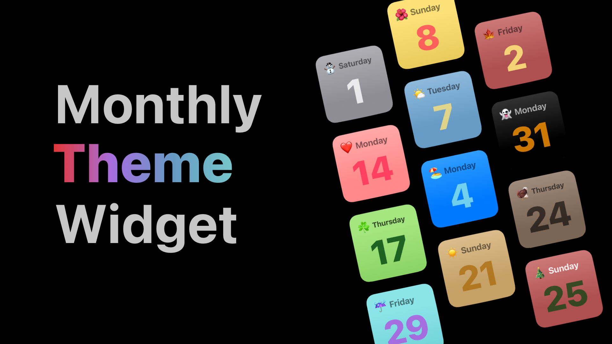

# WidgetKit
A place to experiment with WidgetKit. This readme has notes from official apple video about WidgetKit and glimpse of my applications. 

# WWDC 2020 : Widget Kit Notes
## [Meet WidgetKit](https://developer.apple.com/videos/play/wwdc2020/10028/)

### Widgets are NOT mini apps
Should project content from application than having tiny buttons!

### Goals for a Great Widget Experience
- Glanceble
- Relevant
- Personalized

Widget kit is build entirely on SwiftUI - making it cross platform.

--- 
# WidgetKit Course By [Sean Allen](https://youtu.be/jucm6e9M6LA)

But instead of hardcoding emojis and background color for each month, I have decided to generate them randomly. In the future, will let the user choose themes.
